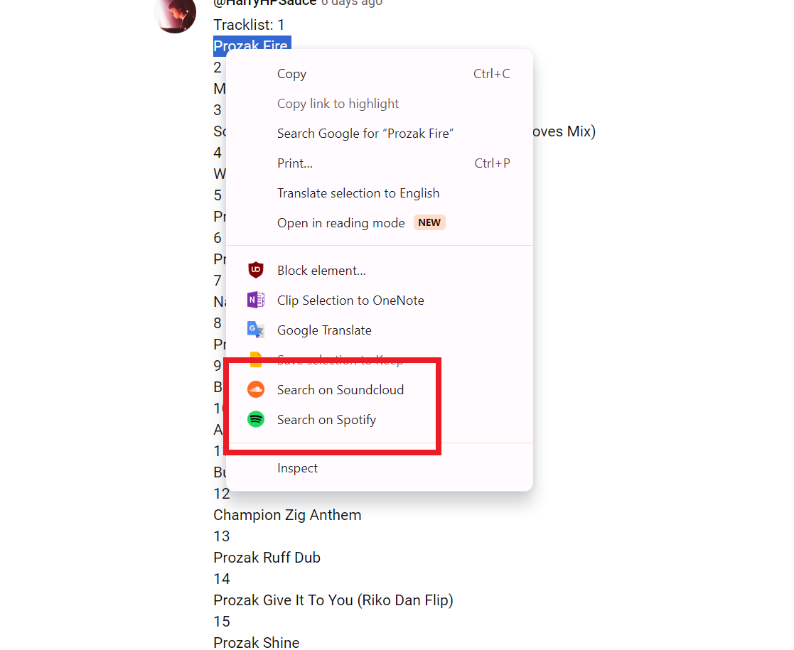

  
  

# Quick Search on SoundCloud/Spotify Chrome Extensions Pack

These Chrome Extensions allow you to highlight text on and quickly search the selected text on Spotify or SoundCloud. 
Right-click and selecting the your desired platform from the context menu. 
I've designed this to help myself and others quickly and seamlessly search for music on two major music libary platforms.

    
  

## Features

- **Easy to Use**: Simply highlight, right-click, and search.
- **Quick Access**: Instantly opens a new tab with search results on Spotify or SoundCloud.
- **Flexible**: Works on any website, making it easier to discover music while browsing.
- **Customisation**: Don't have on of the platforms? Just doon't install that part of the extention.

## Installation

1. Download the ZIP file of the extensions pack from this repository.
2. Unpack the ZIP file on your computer.
3. Open Chrome and search for `chrome://extensions/`.
4. Enable "Developer mode" at the top right.
5. Click "Load unpacked" and select each of the extension folders (`SearchOnSoundcloud` and `SearchOnSpotify`) for each platform.
7. The extensions are now ready to use!
